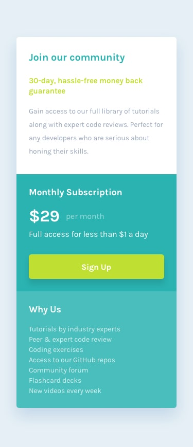

# Frontend Mentor - Single price grid component solution

## Design preview for the Single price grid component coding challenge

| Desktop Version                                          | Mobile Version                                         |
| :------------------------------------------------------- | :----------------------------------------------------- |
|  |  |


## Table of contents

- [Overview](#overview)
  - [The challenge](#the-challenge)
  - [Screenshot](#screenshot)
  - [Links](#links)
- [My process](#my-process)
  - [Built with](#built-with)
  - [What I learned](#what-i-learned)
  - [Continued development](#continued-development)
  - [AI Collaboration](#ai-collaboration)
- [Open for Opportunities & Collaboration](#open-for-opportunities--collaboration)
- [Acknowledgments](#acknowledgments)

## Overview

### The challenge

Users should be able to:

- View the optimal layout for the interface depending on their device's screen size
- See hover and focus states for all interactive elements on the page

### Screenshot

| Desktop Version                                          | Mobile Version                                         |
| :------------------------------------------------------- | :----------------------------------------------------- |
|  |  |

### Links

- Solution URL: (https://github.com/naftalmambo/Blog-Preview-Card-Main)
- Live Site URL: (https://naftalmambo.github.io/Blog-Preview-Card-Main/)

## My process

### Built with

- **Semantic HTML5 markup**
- **CSS custom properties**
- **Flexbox**
- **Mobile-first workflow**
- **Google Fonts (Figtree)**
- **VS Code** - My primary editor for writing clean, structured code.
- **Linux (Ubuntu/WSL)** - My development environment for a professional, stable workflow.
- **Windows Browser (Chrome)** - Used for cross-browser testing to ensure its responsive.

### What I learned

This project was a great exercise in high-contrast UI design. I learned how to create a tactile interaction by manipulating box shadows and transforms on the :active state.

I'm quite happy with this CSS code snippet that makes the card feel tactile, ensured the card fills the shadow completely on click:

```css
.card {
  box-shadow: 8px 8px 0px 0px #000000;
  transition: all 0.3s ease;
}

.card:active {
  transform: translate(8px, 8px);
  box-shadow: 0px 0px 0px 0px #000000;
}
```

I also practiced using semantic HTML to improve accessibility, specifically using the `<time>` tag for the publication date:

```html
<time class="card-date" datetime="2023-12-21">Published 21 Dec 2023</time>
```

### Continued development

In future work, I intend to focus on:

- **Accesibility:** Ensuring every interactive element has perfect `focus-visible` styles for keyboard users. I've come to realise that even though HTML might seem simple but one must be intentional and considerate with every nesting and elements applied. Hence one should use semantic HTML to improve accessibility.

- **Responsiveness:** I believe I've tried my best to make this project as responsive as possible through use of mobile-first approach, while also open to improvements.

### AI Collaboration

I used a large language model trained by **Google** to refine the CSS architecture and ensure the project followed modern best practices.

- **Tools Used:** Google AI.
- **Refining Responsiveness:** I consulted the AI to verify if my CSS was strictly **mobile-first** and discussed the most effective placement for media queries.
- **Code Optimization:** We brainstormed how to combine `width: 90%` and `max-width` to create a **fluid layout** that requires fewer breakpoints.
- **Accessibility Check:** The assistant suggested semantic HTML tags (like `<time>` and `<main>`) and accessibility utilities like a `.sr-only` class to complement my styling.

**What worked well:** The AI was excellent at explaining the **logic** behind mobile-first design, which helped me decide when to keep or remove specific media queries. It also helped ensure my hover and active states (like the card "button press" effect) were implemented smoothly.

## Open for Opportunities & Collaboration

This project marks the beginning of my journey toward becoming a professional Web Developer and ultimately a Java Full-Stack. I am currently:

- 🔭 **Open for work:** Looking for junior roles or freelance opportunities where I can apply my skills in HTML, CSS, and Javascript(in-progress).
- 🤝 **Open to contribute:** Interested in collaborating on open-source projects or team-based challenges.

If you like what you see or have a project you need help with, connect with:

**Author**

- Frontend Mentor - [@naftalmambo](https://frontendmentor.io)
- LinkedIn - [Naftal Mambo](https://linkedin.com)
- GitHub - [@naftalmambo](https://github.com)
- Discord - [devMambo](https://discordapp.com/users/1157321092482994246)

## Acknowledgments

### 🌟 Appreciation for Frontend Mentor

I want to express my sincere gratitude to **[Frontend Mentor](https://www.frontendmentor.io)** for providing these incredible, real-world challenges that I am sure will enable me to grow to be the dev I aspire.

This platform will be more than just a place to practice, it will be a gateway to building skills that truly **change lives**.

By bridging the gap between theory and professional workflows, Frontend Mentor will help me build a rock-solid skill for a future where I can create meaningful digital solutions.

## Credits

While this is a [Frontend Mentor](https://www.frontendmentor.io) challenge, the structural and styling knowledge used to build it was gained through;
* **freeCodeCamp**: For the consistent interactive practice that solidified my HTML and CSS fundamentals.
* **The Odin Project**: For teaching me how to set up my local working environment and to think like a developer.


